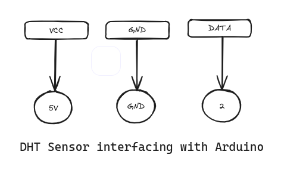

Interfacing a DHT sensor (such as the DHT11 or DHT22) with an Arduino is a common project for measuring temperature and humidity. Here’s a simple guide on how to set up and code your Arduino to read data from a DHT sensor.

# Components Needed
#### 1. Arduino board (Uno, Mega, Nano, etc.)
#### 2. DHT sensor (DHT11 for basic applications or DHT22 for a wider range and higher precision)
#### 3. Resistor (typically 4.7k ohms, sometimes included with the sensor)
#### 4. Breadboard and jumper wires
#### 5. USB cable to connect Arduino to your computer

# Wiring the Sensor
#### - VCC to Arduino 5V (or 3.3V depending on your model).
#### - GND to Arduino GND.
#### - DATA to a digital pin on the Arduino (e.g., pin 2).
#### - Place the resistor between VCC and the DATA pin (this acts as a pull-up resistor).

# Installing the DHT Sensor Library
Before you start programming, you need to install the DHT sensor library in the Arduino IDE:

1. Open Arduino IDE.
2. Go to Sketch > Include Library > Manage Libraries.
3. In the Library Manager, enter “DHT sensor library” into the search box.
4. Find the library by Adafruit and install it.

# Arduino Code

See the DHTSensor.ino file

# I don't have Resistor?

If you don't have a resistor available for your DHT sensor setup, you can sometimes connect the sensor directly to your Arduino without a pull-up resistor, although this is not recommended for optimal performance and reliability. The pull-up resistor is typically crucial for stabilizing the data signal from the DHT sensor.